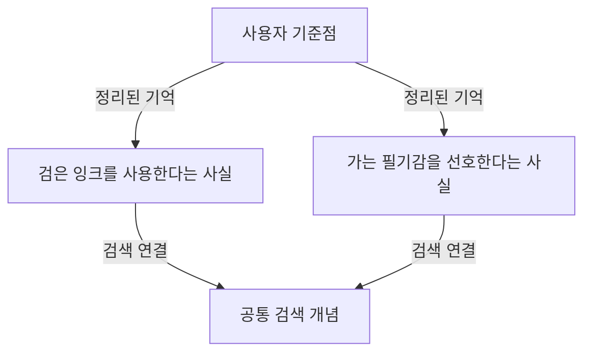

# MAI의 기억은 어떻게 만들어지고, 어떻게 다시 꺼내 쓰는가

작성 기준: 2026년 10월 7일, `dev`의 `16f9e5b15e62523f79329a53b927bb053f693a49`.

이 문서는 이 시점의 코드를 직접 읽고 정리한 설명이다. 이전에 논의했던 방향이나 다른 작업 브랜치의 변경 사항을 현재 작동하는 기능처럼 섞지 않았다. 실행 중인 서버의 버전이나 개인 설정 파일은 따로 확인하지 않았으므로, 여기서 말하는 현재는 위 코드 기준이다.

영어는 코드에서 실제로 사용하는 이름을 알아야 할 때만 남겼다. 설명에 등장하는 만년필이나 계획 이야기는 구조를 이해하기 위한 가상의 예시다. 아래에 나오는 정리 문장도 추출 결과의 예시이며, 모델이 반드시 그 문장 그대로 저장한다는 뜻은 아니다.

## 읽는 순서

1. [기억이라고 부르는 것부터 구분하기](#1-기억이라고-부르는-것부터-구분하기)
2. [기억을 이루는 자료와 연결](#2-기억을-이루는-자료와-연결)
3. [한 번의 대화가 기억으로 남는 과정](#3-한-번의-대화가-기억으로-남는-과정)
4. [무엇을 사실의 근거로 인정하는가](#4-무엇을-사실의-근거로-인정하는가)
5. [저장한 기억을 다시 찾는 과정](#5-저장한-기억을-다시-찾는-과정)
6. [기억이 바뀌거나 누락되는 상황](#6-기억이-바뀌거나-누락되는-상황)
7. [저장 파일과 설정](#7-저장-파일과-설정)
8. [실제 예시로 전체 흐름 따라가기](#8-실제-예시로-전체-흐름-따라가기)
9. [현재 구현의 경계](#9-현재-구현의-경계)
10. [코드와 기록에서 확인하는 방법](#10-코드와-기록에서-확인하는-방법)

## 1. 기억이라고 부르는 것부터 구분하기

### 1.1. 대화를 저장하는 것과, 기억하는 것은 조금 다르다

MAI의 기억을 이해하려면, 먼저 대화 기록과 장기기억을 구분해야 한다.

가령 사용자가 “나는 검은 잉크를 쓰고 있어”라고 말했고, MAI가 “알겠어”라고 답했다고 해보자. 이 대화 자체를 보관하는 것이 대화 기록이다. 누가 무슨 말을 했는지, 대화창에 어떤 문장이 표시됐는지를 남기는 쪽이다.

그런데 나중에 “내가 쓰는 잉크 색이 뭐였지?”라는 질문에 답하려면, 매번 모든 대화를 처음부터 읽는 것은 부담스럽다. 그래서 대화에서 다시 사용할 만한 내용을 골라 “사용자는 검은 잉크를 사용한다” 같은 짧은 사실로 정리한다. 이쪽이 장기기억이다.

즉, 대화 기록에는 질문과 답변이 그대로 쌓이고, 장기기억에는 그중 다시 쓸 가치가 있다고 판단한 내용이 별도로 쌓인다. 대화창에서 어떤 말을 확인할 수 있다고 해서, 그 말이 장기기억에도 반드시 들어가 있다는 뜻은 아니다.

### 1.2. 현재 MAI에는 네 가지 층이 있다

| 구분 | 무엇을 담는가 | 어디에 있는가 | 언제 사용하는가 |
| --- | --- | --- | --- |
| 대화 기록 | 사용자의 메시지와 MAI의 답변, 일부 부가 기록 | 기본값 기준 `data/chat.sqlite3` | 대화창 복원, 최근 대화 전달 |
| 원문 보관 | 기억 저장 대상으로 남긴 사용자 메시지의 원문 | `data/memory.sqlite3`의 `evidence` | 정리 이전의 입력 보존 |
| 장기기억 | 사용자 기준점, 정리된 사실, 검색용 개념, 이들의 연결 | `data/memory.sqlite3`의 기억 관련 표 | 다른 대화에서도 꺼내 쓸 기억 |
| 이번 답변의 작업용 기억 | 이번 답변에서 조회하거나 확장한 기억 조각 | 실행 중인 메모리의 `WorkingGraph` | 한 번의 답변을 만드는 동안 |

원문 보관과 장기기억은 같은 저장 파일 안에 있지만 역할은 다르다. 원문은 사용자가 실제로 입력한 내용을 보관하고, 장기기억은 모델이 나중에 활용할 수 있게 정리된 내용을 보관한다.

작업용 기억은 장기기억을 통째로 복제한 것이 아니다. 이번 답변에서 필요한 부분만 읽어와 잠시 모아두는 공간이다. 새 사용자 메시지를 처리할 때는 새로운 작업용 기억을 만든다.

이 네 가지 외에도 모델이 답변을 생성할 때 받는 문맥이 있다. 여기에 최근 대화, 이번 질문, 사용 가능한 도구 안내, 도구로 읽은 기억 등이 들어간다. 작업용 기억 객체 전체가 매번 자동으로 모델에게 전달되는 것은 아니다. 모델은 실제 도구 반환값을 통해 조회 결과를 읽는다.

### 1.3. 모델 자체를 다시 학습시키는 방식은 아니다

현재 MAI의 장기기억은 모델의 학습값을 바꾸는 방식으로 작동하지 않는다. 기억을 저장했다고 해서 모델 파일 자체가 사용자의 정보를 배운 상태로 바뀌는 것은 아니다.

기억은 별도의 저장소에 남아 있고, 필요할 때 읽어서 답변에 사용한다. 따라서 대화에 쓰는 모델을 바꿔도 같은 기억 저장소를 사용할 수 있다. 검색도 모델별 의미 벡터에 의존하지 않는다.

다만 기억을 정리하는 작업은 언어 모델이 한다. 같은 원문을 주더라도 선택한 모델에 따라 어떤 사실을 골라내는지, 문장을 어떻게 정리하는지는 달라질 수 있다. 저장소의 공유와 추출 품질의 일관성은 별개의 문제다.

### 1.4. 저장되어 있다고 해서 늘 읽는 것은 아니다

현재 실제 대화 처리 경로에서는 질문을 받을 때마다 장기기억을 자동으로 끼워 넣지 않는다. 모델이 기억 도구를 호출해야 저장된 내용을 읽는다.

예를 들어 바로 앞 메시지에 잉크 색이 적혀 있다면 최근 대화만으로 답할 수 있다. 한참 전 다른 대화에서 말했던 내용이라면 기억 도구를 사용해야 한다.

코드에는 `auto_recall`이라는 자동 조회 함수가 남아 있다. 하지만 현재 웹 대화 처리에서는 이 함수를 시작 단계에 호출하지 않는다. 함수가 존재한다는 것과, 실제 대화마다 그 함수가 실행된다는 것은 구분해야 한다.

## 2. 기억을 이루는 자료와 연결

### 2.1. 왜 문장만 모아두지 않고 연결 구조를 사용하는가

기억을 문장 목록으로만 보관해도 간단한 검색은 가능하다. 하지만 특정 문장이 누구의 기억인지, 어떤 검색 개념과 연결되는지, 주변에 어떤 내용이 있는지를 함께 다루려면 관계를 남기는 편이 유용하다.

현재 MAI는 정보를 담은 항목과, 항목 사이의 연결을 따로 저장한다. 코드에서는 항목을 `node`, 연결을 `edge`라고 부른다. 이 문서에서는 각각 기억 항목과 연결이라고 부른다.

“그래프”라는 말은 이런 연결 구조를 뜻한다. 그림을 그려서 보관한다는 뜻이 아니라, 어느 항목이 어느 항목과 어떤 관계로 이어지는지를 자료로 저장한다는 뜻이다.

### 2.2. 사용자 기준점

사용자 기준점은 “이 기억은 어느 사용자의 기억인가”를 나타내는 시작점이다. 내부 이름은 `anchor`다.

사용자마다 하나씩 만들며, 내부 사용자 식별값과 기준점 번호를 `user_anchors`에 연결해둔다. 이미 기준점이 있으면 기존 항목을 다시 사용한다.

기준점의 표시 문장은 `user_anchor::내부식별값` 형태다. 이 문장 자체에 사용자의 취향이나 개인 정보가 모두 들어가는 것은 아니다. 해당 사용자의 사실 항목으로 이어지는 출발점이다.

기준점은 검색용 개념 색인에 넣지 않는다. 사용자의 기억을 단어로 검색하는 것과, 기억의 소유자를 구분하는 것은 역할이 다르기 때문이다.

### 2.3. 정리된 사실

정리된 사실은 나중에 다시 사용할 수 있도록 독립된 문장으로 만든 기억이다. 내부 이름은 `fact`다.

예를 들어 다음과 같은 문장이 될 수 있다.

> 사용자는 검은색 잉크를 사용한다.

이 문장은 “검은색”처럼 조각만 있는 것이 아니라, 누가 무엇을 사용한다는지 알아볼 수 있게 정리한 문장이다. 선호, 계획, 변경 사항, 프로젝트 상태, 사용자와 관련된 도구 확인 결과도 이런 형태로 정리할 수 있다.

여기서 사실이라는 이름은 “절대로 틀리지 않는 진실”을 뜻하지 않는다. 현재 근거 처리와 추출 절차를 거쳐 기억으로 채택된 문장이라는 뜻이다. 추출 과정에서 의미를 잘못 정리하거나, 시간이 지나 내용이 바뀌면 이 항목도 부정확해질 수 있다.

### 2.4. 검색용 개념

검색용 개념은 기억으로 들어가는 검색 입구다. 내부 이름은 `concept`다.

사실 문장을 외부 문장 분할 도구인 `Sentence_Breaker`에 넘겨 조각으로 나누고, 그 조각을 개념 항목으로 저장한다. 이미 같은 개념 문장이 있으면 기존 항목을 사용한다.

가령 “사용자는 검은 잉크를 사용한다”라는 사실에서 어떤 조각이 나올지는 분할 도구의 실제 결과에 달려 있다. 설명을 편하게 하기 위해 “잉크”라는 조각을 예로 들 수는 있지만, 모든 입력에서 반드시 명사만 깔끔하게 뽑힌다고 가정해서는 안 된다.

개념은 사실 그 자체와 다르다. “잉크”라는 개념만으로는 사용자가 어떤 잉크를 쓰는지 알 수 없다. 검색으로 개념을 찾고, 그 개념에 연결된 사실을 읽어야 내용이 나온다.

동일한 개념은 사용자 구분 없이 재사용한다. 반면 사실 항목의 식별 기준에는 사용자 식별값이 들어간다. 따라서 개념은 공유되는 검색 좌표이고, 사실은 사용자별로 만들어지는 문장이다. 이 차이는 [사용자 구분의 구현 범위](#94-사용자-구분에는-구현상-경계가-있다)에서도 중요하다.

### 2.5. 원문과 발화 항목은 다르다

저장 구조에는 `utterance`라는 발화 항목도 있다. 발화 항목을 만드는 함수도 남아 있다.

하지만 현재 실제 기억 저장 흐름에서는 새 발화 항목을 만들지 않는다. 사용자의 원문은 `evidence`라는 별도 표에 저장하고, 그래프에는 정리된 사실과 검색용 개념을 만든다.

따라서 다음 두 가지를 구분해야 한다.

| 이름 | 현재 역할 |
| --- | --- |
| `evidence`의 원문 | 현재 저장 경로에서 사용자 입력을 보관하는 자료 |
| `utterance` 항목 | 구조와 함수는 남아 있고, 기존 자료나 직접 만든 그래프에서 존재할 수 있는 발화 항목 |

원문을 보관한다고 해서 그 원문이 그래프 안에서 바로 연결되고 검색되는 것은 아니다. 특히 현재 새 사실 항목에는 원문 번호가 저장되지 않는다. 이 부분은 [원문과 사실의 연결](#91-원문-보존과-원문으로의-역추적은-다르다)에서 다시 설명한다.

### 2.6. 현재 새 기억에는 어떤 연결을 만드는가

현재 정상적인 새 기억 저장 흐름에서는 두 종류의 연결을 만든다.

| 출발점 | 도착점 | 연결 이름 | 뜻 |
| --- | --- | --- | --- |
| 사용자 기준점 | 정리된 사실 | `asserted_fact` | 이 사용자의 기억으로 정리된 사실이다 |
| 정리된 사실 | 검색용 개념 | `mentions` | 이 사실을 이 개념과 연결해 검색할 수 있다 |

구조를 그림으로 보면 다음과 같다.

이 그림에서 개념 하나에 여러 사실이 연결될 수 있다는 점이 핵심이다. 개념은 기억을 찾는 입구이고, 사실 항목은 답변에 사용할 내용이며, 기준점은 그 기억이 속한 사용자를 나타낸다.

원문 표는 이 그림에 넣지 않았다. 현재 새 사실과 원문 사이에는 실제로 저장되는 연결이 없기 때문이다.

### 2.7. 항목에 함께 저장하는 정보

각 기억 항목에는 본문 외에도 다음 정보가 들어간다.

| 실제 이름 | 쉬운 뜻 | 현재 용도 |
| --- | --- | --- |
| `id` | 항목 번호 | 다른 항목이나 도구가 해당 기억을 지정할 때 사용 |
| `identity_key` | 같은 항목인지 판단하는 식별 문자열 | 중복 생성 방지 |
| `node_type` | 항목 종류 | 기준점, 발화, 사실, 개념 구분 |
| `canonical_text` | 대표 문장 | 기억 본문 또는 개념 문자열 |
| `payload_json` | 부가 정보 | 사용자 식별값 등 저장 |
| `occurrence_count` | 같은 항목이 다시 기록된 횟수 | 기준점의 기본 사실 목록 정렬 등에 사용 |
| `created_at` | 처음 만들어진 시각 | 기록 시점 확인 |
| `last_seen_at` | 다시 기록된 최근 시각 | 최근성 정렬 등에 사용 |

현재 실제 실행 경로에서 기억 관련 시각은 UTC로 기록한다. 시각을 문자열로 바꿀 때도 시간대가 포함된 시각을 요구한다.

`last_seen_at`은 해당 사실이 현실에서 바뀐 시각과 다르다. 저장소에서 그 항목이 다시 기록된 시각이다. “지난달 이사했다”라는 기억을 오늘 저장하면, 항목을 만든 시각은 오늘이 된다. 이사한 날짜를 별도 날짜 필드로 자동 분리해 보관하는 구조는 아니다.

### 2.8. 연결의 출처 표시는 어느 정도로 자세한가

연결에는 `provenance`라는 생성 경위 문자열이 있다. 현재 사용자 기준점과 사실 사이에는 `user_assertion`, 사실과 개념 사이에는 `fact_index`가 들어간다.

다만 `user_assertion`이라는 이름을 그대로 읽어서, 이 연결에 붙은 사실은 모두 사용자가 직접 말한 내용이라고 해석하면 안 된다. 현재 저장 함수는 사용자 직접 발언에서 나온 사실과 도구에서 확인한 사실을 이 단계에서 나누지 않고 같은 연결 이름으로 저장한다.

즉, 연결의 생성 경위는 남지만, 어떤 발언이나 어떤 도구 결과가 그 사실의 정확한 근거였는지까지 영구적으로 자세히 남는 것은 아니다.

## 3. 한 번의 대화가 기억으로 남는 과정

### 3.1. 먼저 같은 사용자의 이전 기억 저장이 끝났는지 확인한다

새 질문을 처리하기 전에, 같은 사용자의 이전 답변에서 시작한 기억 저장 작업이 남아 있는지 확인한다. 남아 있다면 그 작업을 기다린다.

이렇게 하는 이유는 간단하다. 사용자가 “나는 검은 잉크를 쓰고 있어”라고 말한 직후 “그럼 내가 쓰는 잉크 색이 뭐야?”라고 물을 수 있기 때문이다. 이전 답변의 기억 저장이 끝나기도 전에 다음 질문에서 기억을 읽으면 방금 말한 내용이 빠질 수 있다.

기다리는 대상은 같은 내부 사용자 식별값의 작업이다. 다른 사용자의 작업을 모두 기다리는 방식은 아니다.

이 처리는 이전 답변 뒤에 진행 중인 기억 작업을 기다리는 장치다. 같은 사용자가 여러 대화창에서 동시에 질문하는 모든 상황을 하나의 대기열로 완전히 직렬 처리하는 장치라고까지 해석할 수는 없다.

### 3.2. 이번 답변에 사용할 빈 작업용 기억을 만든다

이전 저장 작업 확인 뒤에는 새로운 작업용 기억을 만든다. 처음에는 빈 상태다.

사용 가능한 기억 조회 도구는 이 작업용 기억과 현재 사용자에 연결된다. 모델이 기억을 읽거나 주변을 확장하면 그 결과가 여기에 모인다.

이때 장기기억 전체를 읽어오지는 않는다. 최근 대화는 별도로 전달하고, 장기기억은 모델이 도구로 요청하는 방식이다.

### 3.3. 모델이 필요한 도구를 사용하고 답변을 만든다

모델은 질문을 보고 답변을 만든다. 필요하면 기억 도구, 파일 읽기, 웹 조회, 계산 등의 도구를 사용할 수 있다.

장기기억에서 읽은 과거 정보와 이번에 확인한 정보가 다르면, 현재 사용자 메시지와 현재 도구 결과를 우선하라는 지침이 기억 도구의 안내에 들어간다.

예를 들어 예전 기억에는 파란 잉크라고 되어 있지만, 사용자가 이번에 “지금은 검은 잉크로 바꿨어”라고 말했다면 이번 답변은 새 정보를 따라야 한다. 다만 이런 답변 우선순위 지침이 저장소의 옛 기억을 자동 삭제한다는 뜻은 아니다.

### 3.4. 최종 답변을 검증하면서 사용자 근거도 정리한다

답변을 내보내기 전에는 최종 검증을 수행한다. 숫자 검증과 모델을 사용하는 단계별 검토가 있으며, 기억과 직접 이어지는 부분은 사용자 사실 근거와 검증된 답변 문장을 얻는 과정이다.

첫 번째 모델 검토는 답변이 요청에 맞는지 보고, 답변 안의 중요한 사실 주장을 뽑고, 사용자가 직접 진술한 사실을 사용자 메시지에서 골라낸다.

두 번째 모델 검토는 답변의 각 사실 주장을 실제 근거와 비교한다. 어떤 사용자 발언이나 도구 결과가 그 주장을 뒷받침하는지 근거 번호를 붙인다.

이때 최근 대화 전체와 사용자 요청 전체를 통째로 사실 근거로 삼지는 않는다. 대화 문맥은 지시 대상과 질문을 이해하는 자료이고, 실제 사실 주장을 뒷받침하는 자료는 별도로 등록한다.

### 3.5. 답변이 끝나면 뒤에서 기억 정리를 시작한다

정상적으로 답변을 만든 뒤, 기억 정리 작업을 별도로 시작한다. 답변을 반환하기 전에 기억 정리가 전부 끝나기를 기다리는 구조는 아니다.

순서를 실제 코드에 맞춰 쓰면 다음과 같다.

1. 이전에 진행 중인 같은 사용자의 기억 작업을 기다린다.
2. 이번 답변을 만들고 검증한다.
3. 기억 정리 작업을 시작해둔다.
4. 완성한 답변을 반환한다.
5. 기억 정리 작업에서 허용된 근거를 모은다.
6. 모델에게 오래 남길 사실을 정리하게 한다.
7. 저장 생략 조건을 확인한다.
8. 생략 대상이 아니면 사용자 원문을 저장한다.
9. 추출된 사실과 검색용 개념, 연결을 저장한다.

별도 작업은 서버와 무관한 외부 작업 서비스가 아니라, 같은 서버 과정 안에서 돌아가는 비동기 작업이다. 따라서 서버가 종료되면 아직 끝나지 않은 작업이 계속 실행되는 것은 아니다.

### 3.6. 원문은 실제로 언제 저장되는가

현재 실제 경로에서는 원문을 답변 생성 전에 저장하지 않는다. 기억 정리 작업에서 사실 추출을 시도하고 저장 생략 여부를 판단한 다음 저장한다.

이 차이는 중요하다. “모든 사용자 입력을 무조건 먼저 장기기억 원문 표에 넣는다”라고 설명하면 현재 코드와 맞지 않는다.

웹 대화 기록 쪽은 별개다. 웹 처리에서는 사용자 메시지를 대화 기록에 먼저 남긴 뒤 답변 처리를 시도한다. 그래서 답변 생성이 실패해도 웹 대화 기록에 사용자 입력이 남을 수 있다. 그렇다고 기억 원문 표에도 같은 입력이 남았다고 볼 수는 없다.

### 3.7. 사실을 정리할 때는 같은 대화 모델을 사용한다

이번 답변에 선택한 모델을 기억 정리에도 사용한다. 별도의 기억 전용 모델 설정은 없다.

다만 기억 정리 요청에서는 `think=False`로 설정한다. 도구도 주지 않는다. 정해진 자료를 보고 허용된 사실 문장과 근거 번호를 반환하게 하는 역할이다.

이 작업은 다음과 같은 자료를 받는다.

| 자료 | 어떤 역할인가 |
| --- | --- |
| 이번 사용자 메시지 원문 | 문맥 이해 |
| 직전의 유효한 답변 메시지 | 지시 대상이나 대화 흐름 이해 |
| 이번 최종 답변 | 무엇을 답했는지 이해 |
| 허용된 사용자 직접 발언 | 사실의 근거 |
| 성공한 비기억조회 도구 결과 | 사실의 근거 |
| 허용된 근거로 검증된 최종 답변의 사실 주장 | 사실의 근거 |

위쪽 세 가지를 읽을 수 있다는 이유만으로 그 내용을 자유롭게 사실로 채택할 수는 없다. 사실로 정리할 때 사용할 수 있는 자료는 아래쪽의 허용된 근거 목록이다.

### 3.8. 사실 추출 결과에는 근거 번호가 필요하다

추출 모델은 각 사실 문장에 하나 이상의 근거 번호를 붙여 반환한다. 실제 이름은 `source_refs`다.

현재 코드에서는 다음을 검사한다.

- 반환 형식이 정해진 구조와 맞는가.
- 사실 문장이 비어 있지 않은가.
- 근거 번호가 하나 이상 있는가.
- 모든 근거 번호가 이번에 허용한 목록에 존재하는가.
- 같은 문장이 반복되어 있지 않은가.

존재하지 않는 근거 번호를 만들어내거나, 근거 없이 사실만 내놓으면 추출 실패로 처리한다.

다만 근거 번호가 유효하다는 것과 사실 문장의 의미가 정확하다는 것은 다르다. 현재 추출 결과의 각 문장을 별도의 두 번째 의미 검증 모델에 다시 보내는 절차는 없다. 과장하지 말고 근거 범위 안에서 정리하라는 지침과, 앞선 근거 선별 및 답변 검증에 의존하는 부분이 있다.

### 3.9. 채택된 사실은 그래프와 검색 색인에 들어간다

추출이 끝나면 사용자 기준점과 사실을 연결한다. 그다음 사실 문장을 분할하여 개념을 만들고, 사실과 개념을 연결한다.

개념이 새로 만들어졌을 때는 검색 색인에도 추가한다. 기존 개념이라면 새 색인 항목을 중복으로 만들지 않는다.

반환 과정에서 사용한 근거 번호는 이 시점 이후 사실 본문과 함께 저장되지 않는다. 현재 `finish_turn`에 전달되는 추출 결과는 사실 문장들의 목록이며, 사실 항목의 부가 정보에는 사용자 식별값만 들어간다.

## 4. 무엇을 사실의 근거로 인정하는가

### 4.1. 사용자가 직접 말한 사실

현재 사용자 근거는 사용자 메시지에서 그대로 잘라낸 문장 조각이다. 코드에서는 `source_excerpt`라고 부른다.

예를 들어 사용자가 다음과 같이 말했다고 해보자.

> 내가 지금 사용하는 건 은색 만년필이야. 잉크는 검은색이고.

검토 모델은 이 메시지 안에서 사실을 직접 말하는 부분을 고른다. 반환한 조각이 분석에 넘긴 해당 사용자 메시지 내용 안에 연속된 문자열로 들어 있는지도 코드가 확인한다. 긴 메시지는 분석용으로 줄여 전달하므로, 원문 전체를 대상으로 다시 검사하는 것과는 차이가 있다.

검토 모델이 “사용자는 은색 만년필을 사용한다”라는 새 문장을 만들어서 사용자 근거로 돌려주는 방식은 이 기준 버전에서 허용하지 않는다. 그런 정리 문장은 뒤의 사실 추출 단계에서 만들 수 있지만, 사용자 근거 그 자체는 원문 조각이어야 한다.

이 차이를 한 번 더 구분하면 다음과 같다.

| 단계 | 문장의 성격 | 예시 |
| --- | --- | --- |
| 사용자 원문 | 실제 입력한 말 | 내가 지금 사용하는 건 은색 만년필이야 |
| 사용자 근거 | 원문에서 그대로 고른 부분 | 내가 지금 사용하는 건 은색 만년필이야 |
| 저장할 사실 | 근거를 바탕으로 정리한 문장 | 사용자는 은색 만년필을 사용한다 |

세 번째 문장이 원문에 그대로 들어 있지 않아도 장기기억 문장으로 만들어질 수는 있다. 다만 그 문장을 사용자가 직접 입력한 원문인 것처럼 취급하는 단계와는 다르다.

### 4.2. 질문이나 요청은 그 자체로 사실이 아니다

“내가 무슨 잉크를 썼는지 기억해?”는 기억을 꺼내 달라는 질문이다. 이 문장만으로 잉크 종류나 색을 새로 알 수는 없다.

“이 내용을 기억해줘”도 저장 요청이지, 기억할 내용이 무엇인지 자체적으로 증명하는 문장은 아니다. 별도로 직접 진술한 내용이 있으면 그 부분을 근거로 삼을 수 있다.

그래서 추출 지침은 질문, 도구 사용 요청, 확인 요청, 단순 지시 자체를 오래 남길 사실로 만들지 말라고 한다. “사용자가 잉크를 물어봤다” 같은 기록이 계속 쌓이는 것을 줄이려는 처리다.

### 4.3. 단순 동의는 이전 답변 전체의 근거가 되지 않는다

MAI가 먼저 여러 내용을 설명했고 사용자가 “응, 맞아”라고 답했다고 해보자. 현재 근거 선별 지침은 이 동의를 이전 답변 속 모든 주장에 대한 사용자 직접 발언으로 바꾸지 않는다.

MAI가 잘못 설명한 내용을 사용자가 부분적으로만 확인했을 수도 있고, 무엇에 동의했는지 범위가 모호할 수도 있기 때문이다. 현재 코드는 승인, 동의, 수락, 평가 자체를 이전 답변의 사실 근거로 사용하지 않도록 지시한다.

예를 들어 다음 차이가 있다.

| 사용자의 말 | 현재 처리 기준 |
| --- | --- |
| 응, 네 말이 맞아 | 이전 답변의 사실들을 사용자 직접 근거로 옮기지 않음 |
| 응, 나는 은색 만년필을 사용해 | 직접 말한 은색 만년필 사용 부분은 근거 후보가 됨 |
| 아냐, 잉크는 파란색이 아니라 검은색이야 | 직접 말한 수정 내용을 근거 후보로 삼음 |
| 그럼 그렇게 수정해줘 | 작업 지시 자체를 실제 수정 완료 사실로 삼지 않음 |

여기서 후보라고 쓴 이유는, 사실을 고르는 단계가 모델 판단이기 때문이다. 원문에 있는지 검사하는 코드는 있지만, 모든 직접 진술을 빠짐없이 골라낼 것을 코드만으로 보장하지는 않는다.

### 4.4. 이번 발언과 과거 발언도 구분한다

답변 검증에는 최근 대화 속 사용자 발언도 근거로 사용할 수 있다. 반면 이번 기억 추출에 넘기는 사용자 직접 근거는 `is_current`가 참인 것, 즉 이번 사용자 메시지에서 나온 것만이다.

이렇게 해서 예전 발언을 최근 대화에 다시 넣었다는 이유만으로 매번 새 사실처럼 저장하는 것을 줄인다.

과거 사용자 발언을 근거로 만든 이번 최종 답변의 주장이 있다고 해도, 그 주장의 근거 번호 전체가 이번 기억 저장에 허용되는 목록에 있어야 한다. 과거 발언의 번호가 포함되어 있으면 그 최종 주장은 이번 기억의 별도 근거로 넘기지 않는다.

### 4.5. 성공한 도구 결과

이번 실행에서 성공한 도구 결과도 사실 추출 근거로 사용할 수 있다. 예를 들어 사용자의 계획 문서를 읽어서 마감일을 확인했다면, 사용자가 마감일을 직접 말하지 않았더라도 도구에서 읽은 내용으로 사실을 정리할 수 있다.

다만 여기에는 두 가지 조건이 있다.

첫째, 도구가 성공한 것으로 기록되어 있어야 한다. 실패한 도구 결과는 장기기억 추출 자료에서 제외한다. 답변 검증에서는 실패 결과의 오류 설명을 근거로 쓸 수도 있지만, 기억 추출의 허용 기준은 더 좁다.

둘째, 기억 조회 도구 결과는 제외한다. `memory_recall`, `memory_overview`, `memory_search`의 결과는 이미 저장되어 있던 기억이다. 이를 새 근거처럼 재사용하면 같은 기억을 읽을 때마다 새 관찰처럼 다시 기록할 수 있다.

이 제외는 도구 이름을 기준으로 한다. 모든 반환 내용의 기원을 끝까지 추적하는 기능은 아니다. 다른 도구가 간접적으로 옛 기억을 반환하는 경우까지 자동으로 판별한다고 볼 수는 없다.

### 4.6. 도구가 읽은 전체 자료를 몰래 더 사용하는 것은 아니다

큰 도구 결과는 한 번에 모델에게 전부 전달하지 않을 수 있다. 기억 추출에는 `context_content`라는 모델 문맥용 결과를 넘긴다.

즉, 원본 자료에 정보가 있더라도 이번 답변에서 실제로 다룬 도구 결과 범위에 들어오지 않았다면 기억 추출이 그 정보까지 자동으로 사용하는 구조는 아니다.

다만 최종 답변의 근거 검토에는 도구 결과별 글자 수 제한이 따로 있다. 따라서 답변 검토와 기억 추출이 각각 보는 범위가 완전히 같은 글자 수라고 단정할 수는 없다. 공통점은 누락된 전체 원본을 자동으로 모두 읽는 방식이 아니라는 점이다.

### 4.7. 검증된 최종 답변의 사실 주장

최종 답변에서 근거가 확인된 사실 주장도 기억 추출에 넘길 수 있다. 하지만 답변 문장이라는 이유만으로 무조건 허용하지는 않는다.

그 주장의 모든 근거 번호가 이번 사용자 직접 근거 또는 이번 성공한 비기억조회 도구 근거에 포함되어 있어야 한다. 하나라도 허용되지 않는 근거가 섞이면 그 주장 전체를 별도 기억 근거에서 제외한다.

예를 들어 기억 조회 결과만으로 답한 “사용자는 파란 잉크를 쓴다”는 이번 답변에서 적절한 과거 정보일 수 있다. 그러나 그 근거가 과거 기억 조회뿐이라면 이번의 새로운 기억 근거가 되지는 않는다.

또 실행 환경이 제공하는 현재 시각도 답변 검증에는 사용하지만, `runtime:current_time` 근거 번호는 이 기억 추출의 허용 목록에 들어가지 않는다. 현재 시각 도구를 직접 호출하여 성공 결과로 받은 경우와는 경로가 다르다.

## 5. 저장한 기억을 다시 찾는 과정

### 5.1. 기억을 찾는 도구는 세 가지다

| 도구 이름 | 역할 | 입력 | 기본 범위 |
| --- | --- | --- | --- |
| `memory_recall` | 특정 주제로 기억 찾기 | 검색 문장 `query` | 검색 입구 최대 5개, 기준점 사실 최대 8개 |
| `memory_overview` | 최근 기억 목록 보기 | 개수 `limit` | 기본 12개, 도구 입력에서 1~50개 |
| `memory_search` | 지정한 기억 주변 보기 | 항목 번호 `node_id` | 일반 항목은 바로 연결된 주변, 자기 기준점은 사실 최대 8개 |

사용자가 “잉크 얘기 기억나?”처럼 주제를 말하면 특정 검색에 가깝고, “나에 대해 뭘 기억하고 있어?”처럼 넓게 물으면 최근 목록에 가깝다. 이미 찾은 항목 주변을 더 확인하려면 확장 도구를 쓴다.

실제 선택은 모델이 한다. 세 도구 모두 매번 자동으로 실행되는 것은 아니다.

### 5.2. 특정 검색은 공백으로 나눈 검색어에서 시작한다

현재 검색 질문은 공백을 기준으로 나눈다. 저장할 사실을 나눌 때 사용하는 문장 분할 도구를 검색 질문 분할에는 사용하지 않는다.

예를 들어 “만년필 잉크 검은색”이라는 검색 문장은 다음 세 조각으로 다룬다.

| 순서 | 검색 조각 |
| --- | --- |
| 1 | 만년필 |
| 2 | 잉크 |
| 3 | 검은색 |

같은 조각이 반복되면 한 번만 검색한다. 각 조각마다 개념 색인에서 가장 좋은 결과 한 개만 고르고, 전체 후보를 정렬한 뒤 최대 5개의 개념을 검색 입구로 사용한다.

따라서 긴 질문의 모든 단어에 연결된 모든 개념을 전부 펼치는 방식은 아니다.

### 5.3. 정확한 문자열 일치를 먼저 찾는다

개념 색인에는 “이 문자열은 몇 번 개념인가”를 바로 찾는 표가 있다. 저장된 내용을 실행 중에는 파이썬 사전으로 읽어두고, 문자열이 정확히 같은지 먼저 확인한다.

정확히 같은 개념이 있으면 높은 우선순위로 선택한다. 현재 정확 일치 점수는 `1.0`이다. 이것은 사실의 신뢰도나 기억의 진실 확률이 아니라 검색 후보의 우선순위 점수다.

현재 정확 일치에서는 앞뒤 공백을 제거하지만, 같은 뜻의 다른 단어를 하나로 바꾸거나 한국어 조사를 일괄 제거하는 의미 정규화는 하지 않는다.

### 5.4. 정확 일치가 부족하면 글자와 단어 기반 검색을 사용한다

정확 일치만으로는 못 찾거나 검색 수를 채우지 못하면 SQLite의 `FTS5` 검색을 사용한다. 저장된 개념 문자열을 단어 단위로 검색하는 기능이다.

현재 설정은 `unicode61` 분리 방식을 사용하며, 검색 문자열은 따옴표로 묶은 검색 구문으로 넘긴다. 자동으로 비슷한 뜻의 다른 표현을 추론하는 검색은 아니다.

예를 들어 “잉크”와 “필기액”의 뜻이 비슷하더라도 자동으로 같은 개념이라고 판단한다고 기대하면 안 된다. “잉크”와 “잉크를”도 분할과 저장된 문자열에 따라 결과가 달라질 수 있다. 검색이 실패하면 주제를 더 짧고 정확한 표현으로 바꾸어 다시 조회하는 것이 도움이 될 수 있다.

색인 내부에서는 검색 순위를 계산하고, 정확 일치 다음에 결과를 배치한다. 일반 단어 검색 결과의 반환 점수는 순서에 따라 `0.5`, `0.25` 등으로 내려간다. 현재 조회 함수는 검색 조각마다 한 개를 요청하므로 여러 결과를 무한히 가져오지 않는다.

### 5.5. 개념을 찾으면 그 주변의 사실을 읽는다

검색으로 개념 항목을 찾은 뒤에는 그 개념에 직접 연결된 주변 항목을 읽는다. 여기에는 해당 개념을 언급한 사실이 들어갈 수 있다.

기본 조회 반환값은 사용자 기준점과 사실만 남긴다. 개념이나 발화 항목은 제거한다. 검색 과정에서는 개념을 사용하지만 모델에게 처음 보여주는 결과는 기억의 내용 위주로 줄이는 것이다.

또 찾은 사실에서 현재 사용자의 기준점까지 이어지는 경로가 있으면 그 경로도 모은다. 경로 탐색에서는 연결을 양방향으로 따라갈 수 있게 보지만, 반환되는 연결의 원래 방향 자체는 유지한다.

### 5.6. 검색 결과와 별도로 기본 사실 목록도 붙는다

특정 검색을 호출해도 검색어에 맞는 사실만 반환하는 것은 아니다. 현재 사용자 기준점에 연결된 기본 사실 목록을 함께 읽는다.

이 기본 목록은 최대 8개이며, 다음 순서로 고른다.

1. 같은 항목이 다시 기록된 횟수가 많은 것.
2. 횟수가 같으면 최근에 다시 기록된 것.
3. 시각도 같으면 번호가 큰 것.

따라서 검색어에 해당하는 개념을 하나도 못 찾았어도, 사용자 기준점과 기본 사실 목록이 반환될 수 있다. 무언가 반환되었다는 사실만으로 그 검색어가 제대로 맞았다고 판단하면 안 된다.

반대로 8개라는 숫자가 특정 검색의 전체 사실 수 제한인 것도 아니다. 기본 사실 목록은 8개로 제한하지만, 검색한 개념 주변에는 추가 사실이 붙을 수 있다.

### 5.7. 최근 기억 목록은 기준점 기본 목록과 정렬이 다르다

`memory_overview`는 최근 기억을 보여주는 도구다. 사용자 기준점에서 `spoke` 또는 `asserted_fact`로 이어지는 항목을 찾고, 최근 기록 시각과 항목 번호를 기준으로 정렬한다.

현재 새 기억 저장은 발화 항목을 만들지 않으므로, 새 자료는 보통 사실 항목이다. 다만 과거에 만든 발화와 `spoke` 연결이 있으면 최근 목록에 나타날 수 있다.

이 도구는 반복 횟수를 우선하지 않는다. 또한 반환 목록을 이번 작업용 기억에 합치는 처리는 하지 않는다. 결과를 모델에게 도구 반환값으로 전달하는 역할이다.

### 5.8. 주변 확장은 연결 한 단계씩 읽는다

`memory_search`에 사실이나 개념 번호를 주면, 그 항목과 바로 이어진 연결을 읽는다. 그리고 가능하면 현재 사용자 기준점까지의 경로를 붙인다.

직접 연결된 주변은 한 단계지만, 기준점까지의 경로를 추가하면서 그보다 긴 경로가 결과에 포함될 수 있다. “반환된 모든 항목이 항상 딱 한 단계 거리다”라는 뜻은 아니다.

일반 항목의 주변 확장은 기본 조회처럼 기준점과 사실만 남기지 않는다. 그래서 개념이나 기존 발화 항목도 보일 수 있다.

사용자 기준점 자체를 확장할 때는 예외가 있다. 자신의 기준점은 최대 8개의 정리된 사실만 가져온다. 사용자에게 연결된 모든 대화를 끝없이 펼치는 방식은 아니다. 다른 사용자의 기준점을 직접 지정하면 거부한다.

현재 입력은 양의 항목 번호를 받으며, 그 번호가 이미 작업용 기억 안에 있어야 한다는 검사는 없다. 항목 번호가 존재하는지를 저장소에서 확인하는 쪽이다.

### 5.9. 작업용 기억은 누적되지만, 반환값은 호출별 결과다

한 답변 중에 잉크를 조회하고, 이어서 만년필을 조회할 수 있다. 작업용 기억에는 두 번의 조회에서 읽은 항목이 합쳐진다. 같은 번호의 항목이나 연결은 하나로 관리한다.

하지만 두 번째 조회 결과로 작업용 기억 전체를 다시 보내지는 않는다. 두 번째 조회에서 구성한 결과를 반환한다. 다만 기본 사실 목록이나 공통 경로가 다시 포함될 수 있으므로, 이전 호출과 겹치는 항목이 완전히 제거된다는 뜻은 아니다.

작업용 기억에는 확장한 항목 번호의 집합도 있다. 이 정보는 어떤 항목을 명시적으로 펼쳤는지 기록한다. 현재 주변 확장 함수가 이 집합을 보고 재확장을 무조건 막는 구조는 아니다.

## 6. 기억이 바뀌거나 누락되는 상황

### 6.1. 같은 사실은 어떻게 합치는가

저장소에서 사실의 동일성은 사용자 식별값과 사실 문장으로 판단한다. 앞뒤 공백을 제거한 결과가 같으면 같은 사실 항목을 다시 사용한다.

예를 들어 같은 사용자에 대해 다음 문장이 다시 추출되었다면 기존 항목의 횟수와 최근 기록 시각을 갱신한다.

> 사용자는 검은 잉크를 사용한다.

하지만 다음 두 문장은 의미가 비슷해도 저장소에서는 다른 문자열이다.

> 사용자는 검은 잉크를 사용한다.
>
> 사용자가 사용하는 잉크의 색은 검정이다.

추출 모델에는 의미가 겹치는 사실을 중복으로 만들지 말라는 지침이 있다. 그러나 저장소가 모든 기존 기억과 새 문장을 의미 비교해서 하나로 합치는 것은 아니다. 현재 코드의 확실한 중복 제거 기준은 문자열 일치다.

### 6.2. 반복 횟수는 확신도와 다르다

`occurrence_count`는 같은 항목이 다시 저장된 횟수다. 사실이 세 번 기록되었다고 해서 그것이 3배 더 참이 되는 것은 아니다.

또 이 횟수는 사용자가 같은 말을 실제로 몇 번 했는지 완벽하게 세는 지표도 아니다. 추출 모델이 같은 정리 문장을 반환해야 횟수가 올라간다. 표현이 달라지면 다른 항목으로 기록될 수 있다.

현재 이 횟수는 기준점의 기본 사실 목록을 고르는 우선순위에 사용한다. 별도의 확률적 신뢰도 필드는 없다.

### 6.3. 내용을 바꾸면 옛 기억을 자동으로 덮어쓰는가

사용자가 예전에는 파란 잉크를 썼고 지금은 검은 잉크로 바꿨다고 해보자. 새 정보를 바탕으로 새 사실이 추출되면 그 사실이 저장된다.

하지만 기존 파란 잉크 사실을 자동 삭제하거나 비활성화하는 처리는 현재 없다. 다음 두 문장이 함께 남을 수 있다.

> 사용자는 파란 잉크를 사용한다.
>
> 사용자는 현재 검은 잉크를 사용한다.

이번 답변에서는 현재 발언이 과거 기억보다 우선한다는 안내를 사용한다. 저장된 사실 사이의 충돌을 별도 상태 표로 정리하거나, “이 기억은 새 기억으로 대체되었다”라는 연결을 자동으로 만드는 구조는 아니다.

따라서 답변에서 새 정보를 우선하는 것과, 저장소에서 옛 사실을 정리하는 것은 구분해야 한다.

### 6.4. 기억을 확인하기만 한 대화는 다시 저장하지 않을 수 있다

현재 저장 생략 조건은 세 가지를 모두 만족할 때다.

1. 기억 조회 도구가 하나 이상 성공했다.
2. 사실 추출이 정상적으로 끝났다.
3. 새로 추출한 사실이 없다.

이때는 기억 원문 저장과 사실 저장을 모두 생략한다. 대화 기록은 별도로 남을 수 있다.

가령 “내 잉크 색 기억나?”라고 물어 과거 기억만 읽고 답했다면, 같은 질문을 장기기억에 반복해서 쌓을 필요가 없다는 판단이다.

이 조건은 기억 도구를 썼다는 이유만으로 무조건 생략하는 규칙이 아니다. “잉크 색 기억나? 지금은 검은색으로 바꿨어”처럼 새 정보가 있다면, 그 정보를 정상적으로 추출한 경우 저장한다.

### 6.5. 기억 도구를 쓰지 않았는데 새 사실도 없으면

기억 조회 도구를 성공적으로 사용하지 않은 대화는 위 생략 조건에 해당하지 않는다. 추출된 사실이 없어도 원문만 저장할 수 있다.

즉, “새 사실이 없으면 언제나 아무것도 저장하지 않는다”가 현재 규칙은 아니다. 기억 조회 여부와 추출 성공 여부를 함께 본다.

### 6.6. 사실 추출이 실패하면

사실 추출에 실패하면 경고를 남기고, 빈 사실 목록으로 원문 보관을 시도한다. 추출 실패를 “새 사실이 없다고 정상 판단했다”와 같은 것으로 취급하지 않는다.

왜냐하면 새 사용자 정보가 있었는데 모델 호출이나 출력 형식 문제로 정리를 못 했을 수도 있기 때문이다. 적어도 원문은 보관하려는 처리다.

다만 원문이 남았다고 해서 다음 질문에서 그 내용을 자동으로 검색할 수 있게 된 것은 아니다. 기본 기억 조회는 사실과 개념을 읽는다. 새 사실과 개념이 만들어지지 않았다면 원문만 남고 기억 검색에 잡히지 않을 수 있다.

현재 실패한 원문을 나중에 자동으로 다시 추출하는 작업은 이 실행 경로에 없다.

### 6.7. 저장 중 실패하면 일부만 남을 수 있다

원문 기록, 사실 생성, 연결 추가, 개념 생성, 색인 추가를 전체 묶음 하나로 취급하여 모두 성공하거나 모두 취소하는 구조는 아니다. 각 저장 단계에서 따로 데이터베이스 작업을 확정한다.

따라서 중간에 실패하면 원문은 남았지만 개념 연결이 일부 빠졌거나, 사실은 만들어졌지만 검색 색인 추가가 끝나지 않은 상태가 생길 수 있다. 이런 실패는 뒤에서 경고로 기록되며 이미 반환한 답변을 다시 바꾸지는 않는다.

검색 색인은 시작할 때 기존 개념을 확인하고 부족한 색인 행을 보완하는 처리가 있다. 하지만 이것이 모든 부분 저장 문제를 자동으로 복원한다는 뜻은 아니다. 누락된 사실과 개념의 연결까지 원문을 다시 읽어 만들어주는 기능은 아니다.

### 6.8. 답변 생성 자체가 실패한 경우

기억 정리 작업은 정상적으로 답변 결과를 얻은 뒤 시작한다. 답변 생성 과정이 예외로 끝나면 이 후처리가 시작되지 않는 경로가 있다.

웹 대화 기록에 실패한 질문이 남는 것과, 장기기억 후처리가 실행되는 것은 다른 일이다. “대화창에 남아 있으니 기억에도 들어갔겠지”라고 생각하면 이 경우를 놓칠 수 있다.

### 6.9. 답변은 빨리 왔는데 다음 질문이 느릴 수 있는 이유

기억 정리는 답변 뒤에서 진행하므로, 첫 답변을 받는 시점에는 정리가 덜 끝났을 수 있다. 곧바로 다음 질문을 보내면 같은 사용자의 이전 기억 작업을 기다린다.

따라서 다음 질문의 지연에는 실제 답변 생성 시간 외에 이전 기억 추출 시간이 포함될 수 있다. 기억을 잘못 찾는 문제와, 이전 저장을 기다리는 문제는 다르다.

## 7. 저장 파일과 설정

### 7.1. 기억 저장 파일

기본 기억 파일 경로는 `./data/memory.sqlite3`다. `MEMORY_DB_PATH` 설정으로 바꿀 수 있다.

이 파일에는 다음 표가 들어간다.

| 실제 이름 | 내용 |
| --- | --- |
| `nodes` | 사용자 기준점, 발화, 사실, 개념 항목 |
| `user_anchors` | 사용자 식별값과 기준점 번호의 대응 |
| `evidence` | 원문 종류, 원문 내용, 기록 시각 |
| `edges` | 항목 사이의 연결과 생성 경위 |
| `memory_concept_exact` | 개념 문자열과 개념 번호의 정확 대응 |
| `memory_concept_fts` | 개념 문자열의 단어 검색용 색인 |

정확 대응표와 검색용 색인은 기억 항목과 같은 파일 안에 있지만, 별도의 연결로 접근한다. 새 개념의 영구 번호를 정하는 쪽은 기억 저장소이고, 검색 색인이 새 개념의 정체성을 따로 정하지는 않는다.

### 7.2. 문장 분할 도구의 파일

기본 분할 도구 파일은 `./data/sentence_breaker.sqlite3`다. 설정 이름은 `SENTENCE_BREAKER_DB_PATH`다.

이 파일은 문장 분할 도구가 사용하는 자료다. MAI 사용자의 정리된 사실을 보관하는 장기기억 파일과 같은 역할이 아니다.

MAI 쪽은 분할 도구의 내부 표를 직접 기억 그래프로 취급하지 않고, 문장을 나눈 결과를 받아 개념 항목을 만드는 어댑터를 둔다. 분할 알고리즘 전체는 외부 프로젝트의 구현에 속한다.

### 7.3. 대화 기록 파일

대화 기록의 기본 파일은 `./data/chat.sqlite3`다. 설정 이름은 `CHAT_DB_PATH`다.

현재 웹 대화는 `web_chat_messages`에 저장한다. 내부 사용자 식별값과 대화방 식별값으로 나누며, 사용자와 답변 메시지를 차례로 보관한다.

장기기억은 같은 사용자라면 대화방이 바뀌어도 공통으로 사용한다. 대화 기록은 대화방마다 구분한다. 새 대화방을 열었다는 이유만으로 기존 장기기억이 사라지는 것은 아니다.

### 7.4. 최근 대화를 얼마나 다시 전달하는가

최근 대화 전달 개수는 `SESSION_HISTORY_MESSAGES`로 정한다. 질문과 답변을 한 쌍으로 세는 것이 아니라, 메시지 하나를 하나로 센다.

설정 예시 파일에는 `12`가 들어 있다. 사용자 질문과 답변이 번갈아 한 개씩 쌓인다면 대략 여섯 번의 왕복 대화다. 반면 환경 변수를 아예 지정하지 않았을 때 서버 코드의 기본값은 `24`다.

현재 대화 기록 복원용 경로도 같은 개수 설정을 사용한다. 따라서 데이터베이스에 전체 대화가 남아 있는 것과 화면 복원 요청이나 모델 문맥에 모든 메시지가 포함되는 것은 다르다.

값을 `0`으로 두면 이 경로에서 이전 대화를 전달하지 않는다. 그래도 사용자 메시지와 답변을 기록하는 기능 자체를 끄는 것은 아니며, 장기기억 조회 도구도 별개의 기능이다.

### 7.5. 로그인 이름과 기억의 내부 식별값

계정에는 로그인 이름인 `user_id`와, 자료 구분에 쓰는 `db_id`가 있다. 기억에서 사용하는 사용자 식별값은 `db_id`다.

로그인 이름만 바꾸고 내부 식별값을 유지하면, 기존 기억과 대화 자료를 같은 사용자 자료로 이어서 사용할 수 있다. 반대로 내부 식별값을 바꾸면 기존 기준점과 다른 사용자로 취급될 수 있다.

기억 저장 함수의 매개변수 이름이 `user_id`라고 되어 있더라도, 실제 실행 경로에서 그 자리에 전달하는 값은 계정의 `memory_user_id`, 즉 `db_id`다. 코드 이름과 로그인 이름을 혼동하지 않는 것이 좋다.

### 7.6. 시간 제한

기억 추출기 자체에는 기본 15초 제한이 없다. 별도 제한을 직접 지정하지 않은 현재 실행 경로에서는 추출기의 `timeout_seconds`가 `None`이다.

하지만 모델 요청 자체의 시간 제한은 남아 있다. `OLLAMA_REQUEST_TIMEOUT_SECONDS`의 기본값과 설정 예시 값은 `300`초이며, 대화 생성과 기억 추출 양쪽에 적용된다.

따라서 “15초 제한을 제거했다”와 “모든 시간 제한이 사라졌다”는 다른 말이다. 실제 설정을 바꾸면 모델 요청 제한도 달라진다.

### 7.7. 이번 코드 기준에서 알아두면 좋은 숫자

| 항목 | 기본값 또는 현재 코드의 제한 | 의미 |
| --- | --- | --- |
| 특정 검색의 개념 수 | 5개 | 전체 검색 입구 수 |
| 기준점의 기본 사실 수 | 8개 | 반복 횟수와 최근성으로 고르는 사실 수 |
| 최근 기억 목록 개수 | 12개 | 개수를 지정하지 않은 도구 호출의 기본값 |
| 최근 기억 목록 허용 범위 | 1~50개 | 도구 입력 제한 |
| 최근 대화 개수 | 설정 예시 12개, 환경 변수 누락 시 24개 | 메시지 개수 |
| 모델 요청 시간 제한 | 300초 | 기본값 기준 |
| 사용자 근거 분석에 넣는 메시지 본문 | 메시지별 최대 1,800자 | 분석용 잘라내기 범위 |
| 분석과 근거 검토의 답변 본문 | 최대 6,000자 | 검토용 잘라내기 범위 |
| 근거 검토의 도구 결과 | 최근 최대 10개, 각각 최대 3,500자 | 검토에 들어가는 결과 범위 |
| 큰 도구 결과 처리 기준 | 기본 16,000자 | 도구 결과 표시·분할 기준 설정 |

이 숫자들은 모두 같은 종류의 한도가 아니다. 특히 5개와 8개는 검색 구성 단계의 제한이고, 1,800자나 3,500자는 근거 검토 모델에 전달하는 범위의 제한이다. 어느 하나를 “MAI가 기억하는 전체 양”으로 읽으면 안 된다.

## 8. 실제 예시로 전체 흐름 따라가기

### 8.1. 새 정보를 처음 말한 경우

사용자:

> 나는 은색 만년필을 쓰고 있어. 잉크는 검은색이야.

이 경우의 예상 흐름은 다음과 같다.

1. 이번 메시지를 보고 답변을 만든다.
2. 검증 과정에서 사용자 원문의 직접 사실 부분을 근거 후보로 뽑는다.
3. 완성한 답변을 반환하고 기억 정리를 뒤에서 진행한다.
4. 근거를 바탕으로 만년필 색과 잉크 색을 사실 문장으로 정리할 수 있다.
5. 원문을 보관하고, 사실을 사용자 기준점에 연결한다.
6. 사실 문장을 분할하여 검색 개념과 연결한다.

이때 “은색 만년필”과 “검은색 잉크”를 두 문장으로 나눌지, 하나의 문장으로 묶을지는 추출 모델의 결과에 달려 있다. 저장소가 항상 정해진 개수로 나누지는 않는다.

### 8.2. 나중에 기억을 물어본 경우

사용자:

> 내가 쓰는 잉크 색 기억나?

최근 대화에 해당 내용이 없다면 모델은 기억 조회 도구를 사용할 수 있다. 검색 개념을 통해 관련 사실을 읽고 답한다.

기억 조회에 성공했고, 사실 추출도 성공했으며, 새로 남길 사실이 없다면 장기기억 원문과 그래프 저장을 생략한다. 읽은 과거 사실을 새 관찰처럼 다시 기록하지 않으려는 것이다.

하지만 모델이 기억 조회를 하지 않고 최근 대화만으로 답했다면, 기억 조회 성공이라는 생략 조건이 없으므로 원문이 저장될 수 있다. 질문의 문장 모양만 보고 생략 여부를 결정하지 않는다.

### 8.3. 기억 확인과 변경을 한 문장에 같이 말한 경우

사용자:

> 내가 쓰는 잉크 기억나? 지금은 파란색으로 바꿨어.

앞부분은 기억 확인 요청이고, 뒷부분은 새 사실 진술이다. 기억 조회 결과를 읽었다는 이유만으로 전체 대화를 버리면 새 정보가 사라진다.

현재 처리는 새 사실을 먼저 추출한다. “지금은 파란색으로 바꿨어”라는 직접 진술이 근거로 선택되고 새 사실이 만들어지면 저장 생략 조건에 걸리지 않는다.

다만 예전 검은색 잉크 사실을 자동으로 삭제하지는 않는다. 답변에서는 이번 변경을 우선하고, 저장소에는 새 사실을 추가하는 형태가 될 수 있다.

### 8.4. 이전 답변에 동의만 한 경우

사용자:

> 응, 네가 설명한 내용은 맞아.

이 기준 버전의 지침은 이전 답변 속 사실을 이 동의만으로 사용자 직접 근거로 바꾸지 않는다. 이전 답변은 추출 모델에게 문맥으로 전달할 수 있지만, 그 자체는 근거 번호가 있는 사실 자료가 아니다.

이번에 다른 성공한 도구 결과나 직접 사실 진술도 없고 추출 모델이 지침을 따르면 새 사실은 없다. 기억 조회 여부에 따라 원문만 남거나, 저장이 생략될 수 있다.

### 8.5. 문서를 읽어서 새 사실을 확인한 경우

사용자:

> 내 계획 문서에 적힌 마감일을 확인해줘.

문서 읽기 도구가 성공했고 그 결과에서 마감일을 확인했다면, 그 도구 결과를 기억 추출 근거로 전달할 수 있다. 최종 답변의 마감일 주장도 같은 허용 근거로 검증되었다면 추가 근거로 사용할 수 있다.

하지만 모든 문서 내용이 자동으로 장기기억에 복사되는 것은 아니다. 추출 모델이 사용자 문맥에서 오래 쓸 가치가 있는 내용을 골라내는 단계가 있다.

또 저장된 사실에 문서의 원본 위치나 특정 페이지 번호가 언제나 별도 필드로 남는 것은 아니다. 현재 저장 구조는 사실 문장과 사용자 식별값 중심이다.

### 8.6. 추출이 실패한 경우

사용자:

> 이제 작업 마감일을 다음 주 월요일로 바꿨어.

답변은 정상적으로 만들었지만 뒤의 추출 모델이 잘못된 형식으로 반환했다고 해보자. 그러면 경고를 남기고 원문 보관을 시도한다.

이때 장기기억에 새 마감일 사실이 만들어졌다고 볼 수는 없다. 이후 기억 조회가 새 마감일을 못 찾는다면, 사용자 정보를 아예 받지 않았기 때문일 수도 있지만 추출 단계가 실패했기 때문일 수도 있다.

또 “다음 주 월요일”을 달력 날짜로 바꿔 저장하는 것이 무조건 보장되는 것은 아니다. 현재 시각의 기억 근거 허용 여부와, 근거 범위를 벗어나지 않는 추출 규칙을 함께 봐야 한다. 상대 날짜의 뜻을 추정해서 확정 날짜처럼 저장하면 근거 범위가 바뀐다.

## 9. 현재 구현의 경계

### 9.1. 원문 보존과 원문으로의 역추적은 다르다

현재 원문 표에는 원문 종류, 내용, 기록 시각이 들어간다. 사용자 식별값이나 대화방 번호를 저장하는 칸은 없다.

현재 새 사실 항목에도 해당 원문의 번호, 도구 근거 번호, 추출 때의 근거 번호 목록을 저장하지 않는다. 원문과 새 사실을 이어주는 연결도 만들지 않는다.

따라서 “원문을 보관한다”는 설명은 맞지만, “아무 사실이나 클릭하면 누가 언제 어떤 문장에서 그 사실을 만들었는지 정확히 따라갈 수 있다”는 설명은 현재 구현보다 넓다.

시각이나 문장 내용을 비교해 사람이 찾아볼 수는 있다. 그러나 그것은 저장된 명시적 연결을 따라가는 것과 다르다. 특히 여러 사용자의 원문이 같은 표에 쌓이면 원문만으로 소유자를 확실하게 구분할 수 없는 경우가 있다.

### 9.2. 주변 확장으로 모든 새 원문을 볼 수 있는 것도 아니다

기억 도구 설명에는 원래 문구나 주변 근거가 필요할 때 확장 도구를 사용하라는 안내가 있다. 실제로 그래프 안에 발화 항목이 있고 연결되어 있다면 확장으로 읽을 수 있다.

하지만 현재 새 저장 경로는 발화 항목을 만들지 않는다. 새 원문은 별도 표에만 남는다. 확장 도구가 그 표를 읽어 사실의 원문을 찾아주는 처리는 없다.

따라서 새 사실의 원문을 항상 도구로 되짚어볼 수 있다고 기대하면 안 된다. 도구 설명과 실제 새 저장 경로 사이에 이 차이가 있다.

### 9.3. 모든 관계를 자세하게 이해한 지식 그래프는 아니다

현재 그래프는 사용자 기준점, 정리된 문장, 검색용 조각을 연결하는 구조다. “사용자가 어떤 펜을 소유하고 그 펜의 재질은 무엇인가”를 각각 대상과 속성으로 완전히 분해하여 저장하는 구조는 아니다.

실제 의미의 상당 부분은 사실 문장 안에 들어 있다. 연결 이름도 현재 새 저장 흐름에서는 사용자와 사실, 사실과 개념이라는 비교적 단순한 종류다.

같은 주제를 다룬다는 이유로 모든 사실이 같은 상황에서 나온 것이라고 판단하면 안 된다. 사실별 주제와 적용 범위를 별도의 고정 필드로 보관하는 처리는 현재 이 경로에 없다. 부가 정보 칸은 존재하지만, 실제 새 사실에 넣는 값은 사용자 식별값이다.

### 9.4. 사용자 구분에는 구현상 경계가 있다

기준점과 사실의 식별에는 사용자 구분이 들어간다. 최근 목록도 현재 사용자의 기준점에서 연결된 자료를 조회한다. 다른 사용자의 기준점을 직접 확장하는 것은 거부한다.

그런데 특정 검색의 개념은 전체 저장소에서 공유한다. 개념 주변의 사실을 읽을 때, 사실의 사용자 식별값이 현재 사용자와 같은지 명시적으로 거르는 처리는 현재 조회 함수에 없다.

또 일반 항목 확장은 다른 사용자의 사실 항목 번호인지 직접 검사하지 않는다. 공통 개념을 통해 다른 사용자의 사실과 연결된 경로가 만들어질 수도 있다. 현재 사용자의 기준점까지 경로가 있다는 것만으로 중간에 있는 모든 사실이 그 사용자의 것이라고 보장할 수는 없다.

따라서 사용자별 기준점이 있다는 이유만으로 모든 검색과 확장에서 사용자 기억이 완전히 분리된다고 설명해서는 안 된다. 이것은 현재 코드를 그대로 읽었을 때의 범위이며, 실제 서버에서 특정 자료가 노출되었다는 확인 결과를 뜻하지는 않는다.

### 9.5. 오래된 기억을 지우거나 충돌을 해결하는 관리 기능은 제한적이다

현재 모델에게 제공하는 기억 도구는 읽기 도구 세 가지다. 개별 사실을 수정하거나 삭제하거나, 옛 사실을 새 사실로 대체했다고 표시하는 전용 기억 도구는 없다.

새 정보는 후처리에서 추가하고, 완전히 같은 문장은 횟수와 시각을 갱신한다. 내용이 충돌하는 서로 다른 문장은 공존할 수 있다.

시간이 지났다는 이유만으로 자동 만료시키거나, 중요한 기억만 남기도록 주기적으로 정리하는 작업도 현재 실행 경로에 없다.

### 9.6. 대화창 비우기와 장기기억 초기화는 다르다

대화방 비우기 경로는 해당 사용자의 해당 대화방 기록을 지운다. 기억 데이터베이스의 사실과 개념을 지우는 처리는 아니다.

체험 계정 초기화를 위한 `reset_trial.py`는 별도의 관리용 작업이다. 서버가 멈춘 상태에서 체험 계정의 기억, 대화, 업로드 자료를 정리하도록 되어 있다.

다만 원문 삭제 대상으로 모으는 번호는 발화 항목의 부가 정보에 들어 있는 원문 번호에 의존한다. 현재 새 저장 경로는 발화 항목과 원문 연결을 만들지 않으므로, 원문만 남긴 자료가 이 방식으로 모두 찾아져 지워진다고 보장할 수 없다.

따라서 “초기화했으니 모든 원문까지 완전히 지워졌다”라는 판단은 실제 삭제 범위와 현재 자료 구조를 확인해야 한다. 이 문서는 초기화 작업을 실행한 것이 아니라 해당 코드의 대상을 설명한 것이다.

### 9.7. 근거 선별 모델이 보는 입력에도 제한이 있다

사용자 사실 근거를 분석할 때는 메시지별로 최대 1,800자를 넘긴다. 이번 요청을 이해하기 위한 별도 문맥에는 더 긴 범위를 넣더라도, 실제 사용자 근거 후보를 뽑는 목록은 따로 제한된다.

긴 입력을 줄일 때는 앞부분과 뒷부분을 남기고 중간을 생략한다. 따라서 아주 긴 사용자 메시지의 중간에 중요한 새 사실이 있으면 근거 선별 단계에서 보지 못할 수 있다. 원문을 나중에 보관한다고 해서 이 선별 범위 제한이 사라지는 것은 아니다.

생략 위치에는 안내 문자열을 넣는다. 이 줄어든 입력은 사실을 새로 만드는 자료가 아니라 검토를 위한 표시 범위다. 원문 전체가 전달된 것으로 해석해서는 안 된다.

최종 답변이나 도구 결과 검토에도 글자 수 제한이 있다. 기억 저장의 누락을 분석할 때는 모델 성능뿐 아니라 실제로 전달한 입력 범위를 함께 확인해야 한다.

### 9.8. 별도 저장 작업은 서버 종료를 넘겨 이어지지 않는다

뒤에서 진행하는 기억 작업은 실행 중인 서버의 작업 집합에만 있다. 외부의 영구 작업 대기열에 저장하지 않는다.

서버 종료 처리에서는 남은 작업을 취소한다. 이미 확정된 데이터베이스 자료는 남지만 아직 완료되지 않은 추출이나 저장이 자동 재개되는 것은 아니다.

결국 답변이 화면에 보였다는 사실만으로 그 답변에 대한 기억 후처리까지 완료되었다고 판단할 수는 없다.

## 10. 코드와 기록에서 확인하는 방법

### 10.1. 기억 문제를 볼 때 나눠서 확인할 것

기억이 이상하다면 한 가지 원인으로 묶기보다 다음 순서로 확인하는 편이 이해하기 쉽다.

1. 사용자 메시지가 대화 기록에 들어갔는가.
2. 답변 생성이 정상적으로 끝나 기억 후처리가 시작됐는가.
3. 이번 사용자 직접 근거가 검증 결과에 포함됐는가.
4. 추출 모델에 어떤 근거 목록을 넘겼는가.
5. 사실 추출이 성공했고 어떤 문장을 반환했는가.
6. 원문, 사실, 개념, 연결이 각각 저장됐는가.
7. 기억 조회 도구를 실제로 호출했는가.
8. 검색어가 저장된 개념과 맞았는가.
9. 조회된 사실을 최종 답변에 제대로 사용했는가.

이 중 5번에서 실패했는데 8번의 검색어만 바꾸면 해결되지 않을 수 있다. 반대로 사실은 정상적으로 저장됐는데 모델이 도구를 호출하지 않았다면 저장 로직의 문제라고 볼 수는 없다.

### 10.2. 기록 메시지의 뜻

다음 문자열은 실제 서버 기록을 찾기 위해 그대로 남긴 이름이다.

| 기록 문자열 | 뜻 | 이 기록만으로 알 수 없는 것 |
| --- | --- | --- |
| `MAI memory extraction ok` | 사실 추출 요청과 형식 검사가 정상 종료됨 | 각 사실이 의미적으로 완벽한지 |
| `MAI memory extraction failed` | 사실 추출에 실패했고 원문 보관을 시도할 경로로 감 | 원문 보관도 실제로 성공했는지 |
| `recall_without_new_facts` | 기억 조회 성공, 추출 성공, 새 사실 없음으로 저장 생략 | 과거 질문 전체가 지워졌다는 뜻은 아님 |
| `MAI memory admission stored` | 원문 기록과 해당 사실 저장 경로가 끝남 | 원문과 사실의 명시적 근거 연결이 생겼는지 |
| `MAI background memory admission failed` | 뒤에서 진행하던 기억 기록 단계가 실패함 | 실패 전에 어떤 자료까지 남았는지 |
| `MAI candidate analyzer start` | 사용자 근거와 답변 주장을 분석하는 검토 시작 | 검토나 기억 추출의 성공 여부 |
| `MAI evidence reviewer start` | 답변의 주장별 근거 검토 시작 | 장기기억 저장 완료 여부 |

`facts=0`은 새 사실 문장이 없다는 뜻이다. 정상적으로 새 정보가 없다고 판단한 경우인지, 앞서 추출 실패가 있었는지는 주변 기록을 함께 봐야 한다.

### 10.3. 어떤 파일을 읽으면 되는가

아래 링크는 이 문서가 있는 폴더에서 실제 코드로 이어진다.

| 확인할 내용 | 파일 | 주요 부분 |
| --- | --- | --- |
| 실제 대화와 뒤의 기억 작업 연결 | [대화 실행 조립](../../mai/app/runtime.py) | `run_user_message`, `_postprocess_memory` |
| 사용자 근거와 답변 주장 검토 | [최종 검증](../../mai/agent/verification.py) | `_analyze_candidate`, `_review_evidence` |
| 사실 추출 모델의 입력과 출력 검사 | [사실 추출](../../mai/memory/extraction/service.py) | `OllamaFactExtractor.extract` |
| 원문과 사실 저장 흐름 | [기억 실행 관리](../../mai/memory/runtime.py) | `record_raw_user_evidence`, `finish_turn` |
| 저장을 생략하는 조건 | [저장 판단](../../mai/memory/admission.py) | `should_skip_recall_without_new_facts` |
| 항목 생성, 중복, 주변 조회 | [기억 저장소](../../mai/memory/graph/repository.py) | 항목 생성, `one_hop`, 경로 탐색 |
| 저장 표의 실제 구조 | [기억 표 구조](../../mai/memory/graph/schema.py) | `SCHEMA_SQL` |
| 사실과 연결의 자료 형태 | [기억 자료 정의](../../mai/memory/graph/models.py) | 항목, 원문, 연결 자료형 |
| 검색 입구와 기본 사실 목록 | [기억 조회](../../mai/memory/recall/service.py) | `recall_query`, `_select_query_seeds` |
| 정확 일치와 단어 검색 | [개념 검색 색인](../../mai/memory/index/sqlite_fts.py) | `search`, 시작 시 색인 확인 |
| 문장 분할 도구와 연결 | [문장 분할 연결](../../mai/memory/segmenter.py) | `SentenceBreakerSegmenter` |
| 모델에게 제공하는 기억 도구 | [기억 도구 등록](../../mai/memory/tools.py) | 세 도구와 현재 정보 우선 안내 |
| 이번 답변에서 읽은 기억 누적 | [작업용 기억](../../mai/memory/working.py) | 합치기, 결과 변환 |
| 로그인 이름과 내부 식별값 | [계정 구분](../../mai/app/access.py) | `memory_user_id` |
| 대화 기록 저장 | [대화방 기록](../../mai/app/chat_sessions.py) | `web_chat_messages` |
| 최근 대화 수와 대화방 비우기 | [웹 서버](../../mai/app/server.py) | `_history_limit`, `clear_session` |
| 체험 계정 초기화 범위 | [체험 계정 초기화](../../reset_trial.py) | `_collect_reset_targets`, `_reset_memory` |
| 설정 예시 | [환경 설정 예시](../../.env.example) | 저장 경로, 모델 요청 제한, 최근 대화 수 |
| 모델 요청 시간 제한 | [모델 연결](../../mai/llm/ollama.py) | 요청 시간 제한 적용 |

### 10.4. 기존 검증 사례에서 확인할 수 있는 것

프로젝트에는 기억 관련 검증 코드가 있다. 이 문서를 작성하면서 관련 구현과 검증 사례를 함께 읽었지만, 검증 코드의 이름만 보고 실제 기능을 단정하지는 않았다. 현재 구현과 서로 맞는지를 우선했다.

| 검증 파일 | 주로 확인하는 내용 |
| --- | --- |
| [기억 실행 검증](../../tests/test_memory_runtime.py) | 사실 저장, 새 발화 항목 미생성, 사실 중심 조회, 검색 질문 공백 분할 |
| [사실 추출 검증](../../tests/test_fact_extractor.py) | 직접 근거 전달, 승인만으로 사실 만들지 않기, 근거 번호 검사, 형식 오류 |
| [저장 판단 검증](../../tests/test_memory_admission.py) | 기억 조회 결과 제외, 새 사실이 있는 혼합 대화, 실패 시 원문 보관 경로 |
| [기억 근거 범위 검증](../../tests/test_memory_approval_context.py) | 직전 답변의 문맥 전달, 허용되지 않는 근거가 섞인 최종 주장 제외 |
| [저장 후 조회 대기 검증](../../tests/test_memory_read_after_write.py) | 같은 사용자의 이전 기억 작업 기다리기 |
| [개념 색인 검증](../../tests/test_sqlite_fts_index.py) | 정확 일치와 단어 검색 색인 |
| [기억 저장 구조 검증](../../tests/test_memory_v1.py) | 항목과 연결, 기존 발화 항목 구조 |

가짜 모델이나 단순 분할 도구로 수행하는 검증은 저장과 전달의 규칙을 확인하는 데 유용하다. 다만 실제 선택 모델이 한국어의 동의 범위나 지시 대상을 항상 정확히 이해하는지까지 증명하지는 않는다.

### 10.5. 이 문서를 다시 고쳐야 하는 시점

기억 관련 코드를 바꿨다면 특히 다음 부분을 다시 확인해야 한다.

- 사용자 근거가 원문 조각인지, 정리 문장도 허용하는지.
- 단순 동의와 명시적 사실 진술을 어떻게 구분하는지.
- 원문을 어느 시점에 저장하는지.
- 사실에 원문 번호나 근거 목록을 남기는지.
- 새 사실과 옛 사실의 충돌을 어떻게 처리하는지.
- 특정 검색에서 사용자 구분을 어디서 적용하는지.
- 검색 질문을 어떻게 나누고 어떤 색인을 쓰는지.
- 기본 조회와 확장에서 어느 종류의 항목을 반환하는지.
- 저장 실패나 서버 종료 뒤에 재처리하는 경로가 있는지.

현재 MAI의 기억은 대화에서 허용된 근거를 골라 사실 문장으로 정리하고, 그 문장을 사용자 기준점과 검색용 개념에 연결해 보관하는 방식이다. 이후 모델이 필요할 때 도구로 읽어 답변에 사용한다. 이 흐름을 기준으로 보면, 말을 보관하는 단계와 의미를 정리하는 단계, 다시 찾는 단계에서 각각 무엇이 성공했고 어디서 빠졌는지를 나누어 이해할 수 있다.
